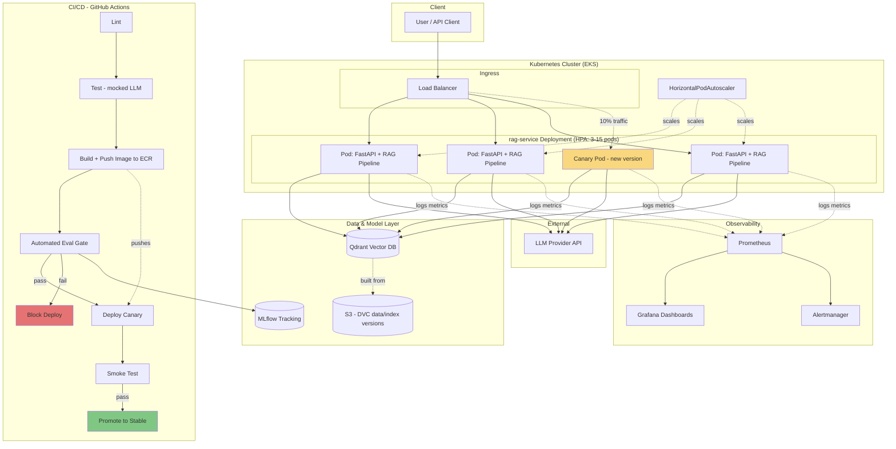

# Production RAG Service

A retrieval-augmented generation service built and operated like a real product:
CI/CD, containerized deployment on Kubernetes, infrastructure as code, observability,
automated quality gating, and load-tested scaling limits — not just a notebook that
answers questions.

**Full design rationale, tradeoffs, and lessons learned:** [`docs/WRITEUP.md`](docs/WRITEUP.md)

## Architecture



**Request flow:** client → load balancer → FastAPI pod → embed query → retrieve top-k
chunks from Qdrant → build grounded prompt → call LLM → return answer + cited sources.
Every request emits latency/token metrics to Prometheus.

**Deploy flow:** push to `main` → lint/test (offline, mocked LLM) → build & push image →
automated eval scores the new version against a golden dataset → if it doesn't regress,
deploy as a canary receiving a slice of traffic → run smoke tests → promote to stable.
A failing eval blocks the deploy before it ever reaches users.

## Project structure

```
app/            FastAPI service, RAG pipeline, vector store abstraction
tests/          Unit + integration tests (offline via mocked LLM)
eval/           Automated quality eval + golden dataset (deploy gate)
mlops/          MLflow tracking, DVC pipeline for data/index versioning
k8s/            Deployment, canary, HPA, ConfigMap manifests
infra/terraform/ EKS cluster, ECR, S3 (IaC)
monitoring/     Prometheus scrape config + alert rules
load_test/      Locust load test
docs/           Architecture + write-up
```

## Running locally

```bash
docker compose up --build
# service:    http://localhost:8000/docs
# mlflow:     http://localhost:5000
# prometheus: http://localhost:9090
# grafana:    http://localhost:3000  (admin/admin)
```

## Running tests

```bash
pip install -r requirements.txt
RAG_MOCK_LLM=true pytest --cov=app
```

## Load testing

```bash
locust -f load_test/locustfile.py --host=http://localhost:8000
```

## Deploying

```bash
cd infra/terraform && terraform init && terraform apply
kubectl apply -f k8s/configmap.yaml
kubectl apply -f k8s/deployment.yaml
```

In practice, deploys go through the GitHub Actions pipeline in
[`.github/workflows/ci-cd.yml`](.github/workflows/ci-cd.yml), not manual `kubectl apply`.

## Status

This is an active portfolio project — see [`docs/WRITEUP.md`](docs/WRITEUP.md) for
what's implemented vs. planned, and known limitations.
